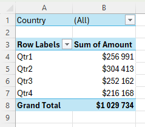

Excel-17

Project Description

Excel-17 is a comprehensive guide to pivot tables in Microsoft Excel. Here you'll find practical tips, concise explanations, and illustrated examples for creating and working with pivot tables, Multi-level Pivot Tables, Multiple Report Filter Fields, Frequency Distribution, Pivot Charts, Slicers and Calculated Field/Item.

Table of Contents

Pivot Tables

Pivot tables are one of Excel's most powerful features. A pivot table allows you to extract the significance from a large, detailed data set. Our data set consists of 213 records and 6 fields. Order ID, Product, Category, Amount, Date and Country.

To insert a pivot table, execute the following steps.

1. Click any single cell inside the data set.
2. On the Insert tab, in the Tables group, click PivotTable.

(Note: Excel automatically selects the data for you. The default location for a new pivot table is New Worksheet.)

3. Click OK.

The PivotTable Fields pane appears. To get the total amount exported of each product, drag the following fields to the different areas.

1. Product field to the Rows area.
2. Amount field to the Values area.
3. Country field to the Filters area.

Result:

Sort a Pivot Table

1. Click any cell inside the Sum of Amount column.
2. Right click and click on Sort, Sort Largest to Smallest.

Filter a Pivot Table

Click the filter drop-down and select France.

Result:

Change Summary Calculation

1. Click any cell inside the Sum of Amount column.
2. Right click and click on Value Field Settings.
3. Choose the type of calculation you want to use. For example, click Count.

4. Click OK.

16 out of the 28 orders to France were 'Apple' orders.

Two-dimensional Pivot Table

If you drag a field to the Rows area and Columns area, you can create a two-dimensional pivot table. Insert new pivot table. To get the total amount exported to each country, of each product, drag the following fields to the different areas.

1. Country field to the Rows area.
2. Product field to the Columns area.
3. Amount field to the Values area.
4. Category field to the Filters area.

Result:

Group Pivot Table Items

The Product field contains 7 items. Apple, Banana, Beans, Broccoli, Carrots, Mango and Orange.

To create two groups, execute the following steps.

1. In the pivot table, select Apple and Banana.
2. Right click and click on Group.

3. In the pivot table, select Beans, Broccoli, Carrots, Mango and Orange.
4. Right click and click on Group.

Result:

To collapse the groups, click the minus signs.

Group Dates

To create the pivot table below, instead of the Product field, add the Date field to the Rows area.

To group these dates by quarters, execute the following steps.

1. Click any cell inside the column with dates.
2. Right click and click on Group.
3. Select Quarters and click OK.

Result:

Quarter 2 is the best quarter.

Multi-level Pivot Table

You can drag more than one field to an area in a pivot table.

First, insert a pivot table. Next, drag the following fields to the different areas.

1. Category field and Country field to the Rows area.
2. Amount field to the Values area.

Result:

Multiple Value Fields

First, insert a pivot table. Next, drag the following fields to the different areas.

1. Country field to the Rows area.
2. Amount field to the Values area (2x).

(Note: if you drag the Amount field to the Values area for the second time, Excel also populates the Columns area.)

Result:

3. Next, click any cell inside the Sum of Amount2 column.
4. Right click and click on Value Field Settings.
5. Enter Percentage for Custom Name.
6. On the Show Values As tab, select % of Grand Total.

7. Click OK.

Result:

Multiple Report Filter Fields

First, insert a pivot table. Next, drag the following fields to the different areas.

1. Order ID to the Rows area.
2. Amount field to the Values area.
3. Country field and Product field to the Filters area.

4. Next, select United Kingdom from the first filter drop-down and Broccoli from the second filter drop-down.

Result:

Frequency Distribution

You can use pivot tables to easily create a frequency distribution in Excel. 

(Note: You can also use the Analysis Toolpak to create a histogram.)

First, insert a pivot table. Next, drag the following fields to the different areas.

1. Amount field to the Rows area.
2. Amount field to the Values area.

3. Click any cell inside the Sum of Amount column.
4. Right click and click on Value Field Settings.
5. Choose Count and click OK.

6. Next, click any cell inside the column with Row Labels.
7. Right click and click on Group.
8. Enter 1 for Starting at, 10000 for Ending at, and 1000 for By.
9. Click OK.

Result:

To compare these numbers, create a pivot chart.

10. Click any cell inside the pivot table.
11. On the PivotTable Analyze tab, in the Tools group, click PivotChart.
12. Click OK.

Result:

Pivot Chart

A pivot chart is the visual representation of a pivot table in Excel. Pivot charts and pivot tables are connected with each other.

Use two-dimensional pivot table from previous example.

1. Click any cell inside the pivot table.
2. On the PivotTable Analyze tab, in the Tools group, click PivotChart.
3. Click OK.

Result:

(Note: any changes you make to the pivot chart are immediately reflected in the pivot table and vice versa.)

Filter Pivot Chart

For example, use the Country filter to only show the total amount of each product exported to the United States.

Remove the Country filter.

Because we added the Category field to the Filters area, we can filter this pivot chart (and pivot table) by Category. For example, use the Category filter to only show the vegetables exported to each country.

Change Pivot Chart Type

1. Select the chart.
2. On the Design tab, in the Type group, click Change Chart Type.
3. Choose Pie.

4. Click OK.

Result:

(Note: pie charts always use one data series (in this case, Beans).)

Slicers

Use slicers in Excel to quickly and easily filter pivot tables. Connect multiple slicers to multiple pivot tables to create awesome reports.

Use the first pivot table.

To insert a slicer, execute the following steps.

1. Click any cell inside the pivot table.
2. On the PivotTable Analyze tab, in the Filter group, click Insert Slicer.
3. Check Country and click OK.

Click United States to find out which products we export the most to the United States.

4. Click any cell inside the pivot table.
5. On the PivotTable Analyze tab, in the Filter group, click Insert Slicer.
6. Check Product and click OK.
7. Select the slicer.
8. On the Slicer tab, in the Slicer Styles group, click a slicer style.
9. Use the second slicer. Hold down CTRL to select multiple products.

Result:

Connect slicers

1. Insert a second pivot table. (On the same worksheet.)
2. Select the first slicer.
3. On the Slicer tab, in the Slicer group, click Report Connections.
4. Select the second pivot table and click OK. (PivotTable5 in this case.)

5. Repeat steps 2-4 for the second slicer.
6. Use both slicers.

Click the icon in the upper-right corner of a Product slicer to clear the filter.

(Note: we didn't export any beans or carrots to Canada.)

Update a Pivot Table

Any changes you make to the data set are not automatically picked up by the pivot table. Refresh the pivot table or change the data source to update the pivot table with the applied changes.

If you change any of the text or numbers in your data set, you need to refresh the pivot table.

1. Click any cell inside the pivot table.
2. Right click and click on Refresh.

(Note: You can check "Refresh data when opening the file" on the Data tab in PivotTable Options to refresh a pivot table automatically when opening an Excel file.)

Calculated Field/Item

A calculated field uses the values from another field. To insert a calculated field, execute the following steps.

1. Click any cell inside the pivot table.
2. On the PivotTable Analyze tab, in the Calculations group, click Fields, Items & Sets.
3. Click Calculated Field.

The Insert Calculated Field dialog box appears.

4. Enter Taxes for Name.
5. Type the formula =IF(Amount>100000, 3%*Amount, 0)
6. Click Add.

7. Click OK.
   
Excel automatically adds the Taxes field to the Values area.

Result:

Calculated Item

A calculated item uses the values from other items. To insert a calculated item, execute the following steps.

1. Click any Country in the pivot table.
2. On the PivotTable Analyze tab, in the Calculations group, click Fields, Items & Sets.
3. Click Calculated Item.

The Insert Calculated Item dialog box appears.

4. Enter Oceania for Name.
5. Type the formula =3%*(Australia+'New Zealand')
6. Click Add.

7. Repeat steps 4 to 6 for North America (Canada and United States) and Europe (France, Germany and United Kingdom) with a 4% and 5% tax rate respectively.
8. Click OK.

Result:

(Note: we created two groups (Sales and Taxes).)

GETPIVOTDATA function

The GETPIVOTDATA function returns visible data from a PivotTable.

Official documentation: https://support.microsoft.com/en-us/office/getpivotdata-function-8c083b99-a922-4ca0-af5e-3af55960761f
